# Serverless Task Management System

A production-grade, secure, and scalable task management system built on AWS using React (TypeScript), Terraform, and Node.js (TypeScript). It features role-based access control, least-privilege IAM, and production-ready monitoring.

---

## Table of Contents
- [Features](#features)
- [Architecture Overview](#architecture-overview)
- [Prerequisites](#prerequisites)
- [Local Development](#local-development)
  - [Backend](#backend)
  - [Frontend](#frontend)
- [Build & Deploy Backend (Terraform)](#1-build--deploy-backend)
- [Frontend Configuration](#2-frontend-configuration)
- [Running the Frontend](#3-running-the-frontend)
- [User Setup & Testing](#user-setup--testing)
- [Security & RBAC](#security--rbac)
- [DevOps & Monitoring](#devops--monitoring)
- [Screenshots](#screenshots)
- [API Overview](#api-overview)
- [AWS Amplify Deployment](#aws-amplify-deployment)
- [Troubleshooting](#troubleshooting)
- [Project Structure](#project-structure)
- [Contributing](#contributing)

---

## Features
- Modern React + Vite frontend with TypeScript and Tailwind CSS
- Serverless backend on AWS Lambda with API Gateway (Cognito Authorizer)
- DynamoDB storage with efficient access patterns for tasks and users
- Strict RBAC (Admin/Member) and domain-restricted sign-up flow
- Infrastructure as Code with Terraform modules
- Production monitoring with CloudWatch Alarms and SNS alerts

---

##  Architecture Overview
- **Frontend**: React + Vite + TypeScript (Hosted on AWS Amplify)
- **API**: AWS API Gateway + Cognito Authorizer
- **Logic**: AWS Lambda (TypeScript)
- **Database**: Amazon DynamoDB
- **Infrastructure**: Terraform (IaC)

---

## Local Development

To run the project locally end-to-end:

### Backend
1. Build backend functions:
    ```bash
    cd backend
    npm install
    npm run build
    # If you have a local runner or emulator, start it here
    ```

### Frontend
1. Start the frontend dev server:
    ```bash
    cd frontend
    npm install
    npm run dev
    ```

The frontend will be available at http://localhost:5173 (or as shown in your terminal).

---

## Screenshots

All key AWS resources and UI screens:

| Resource         | Screenshot |
|------------------|------------|
| API Gateway      | 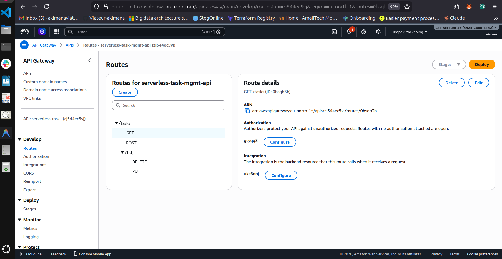 |
| Cognito Groups   | 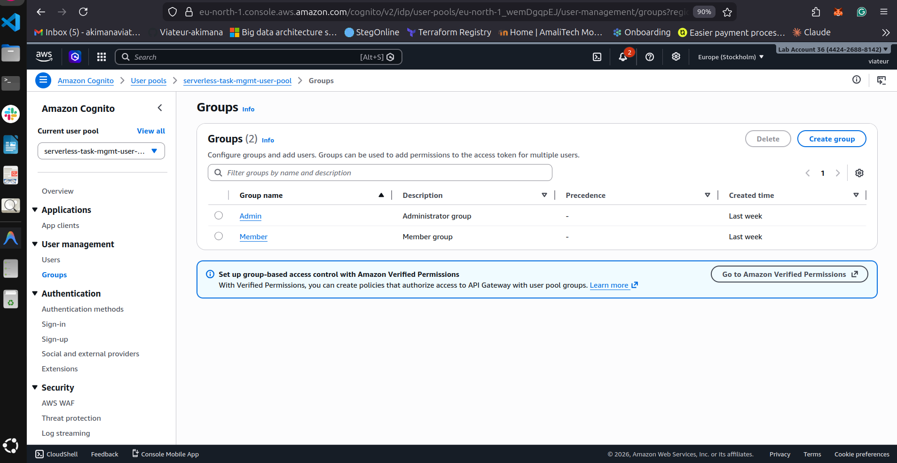 |
| Authorizers      | 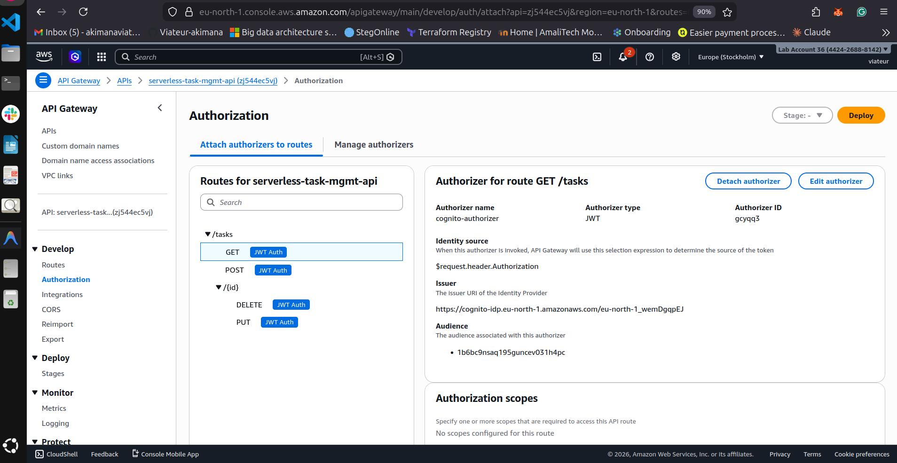 |
| Lambda Function  | 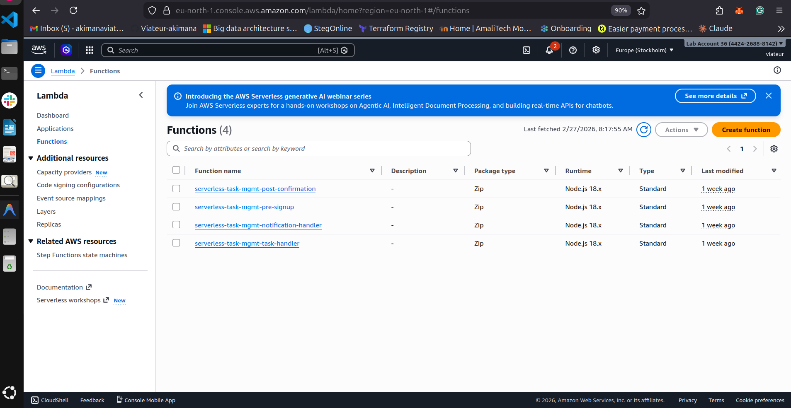 |
| DynamoDB         | 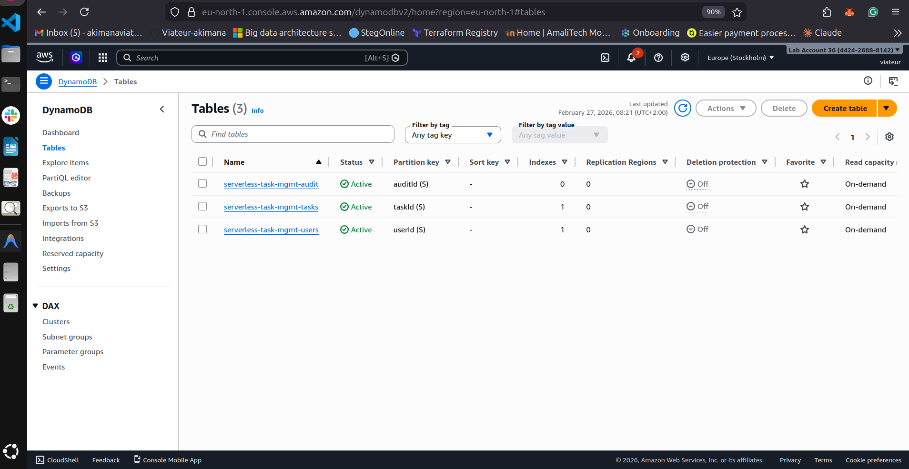 |
| S3 Bucket        | 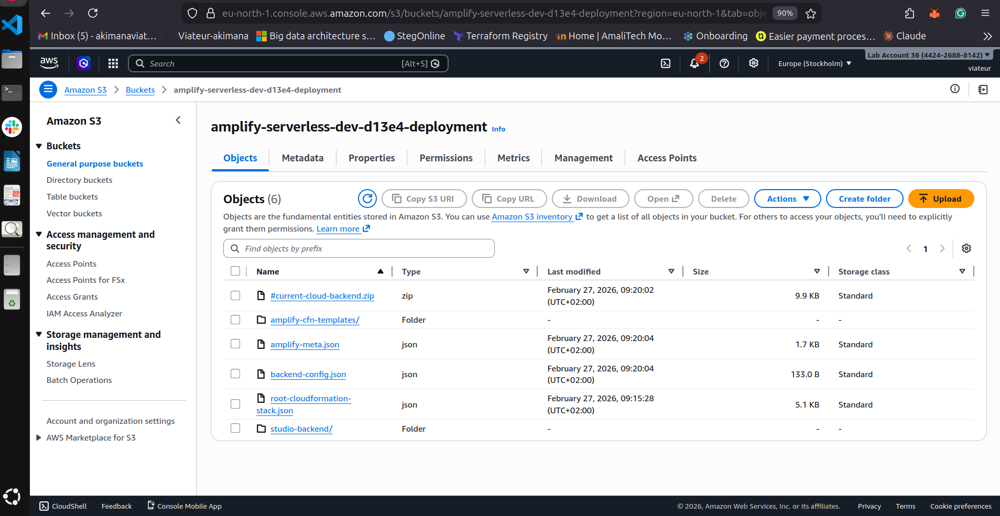 |
| CloudFront       | 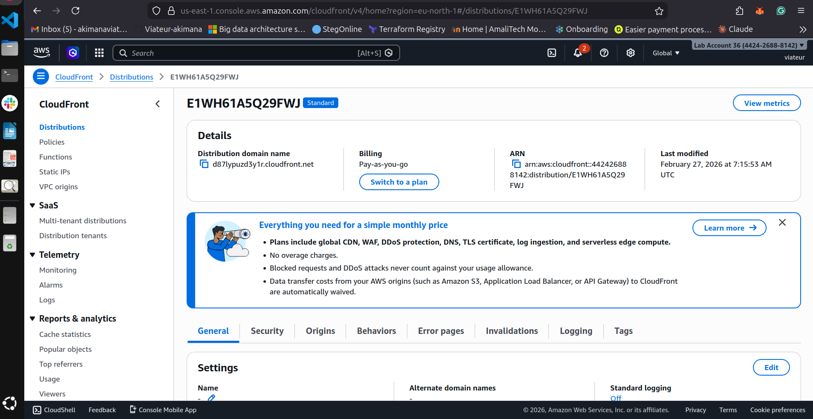 |
| SNS Topic        | 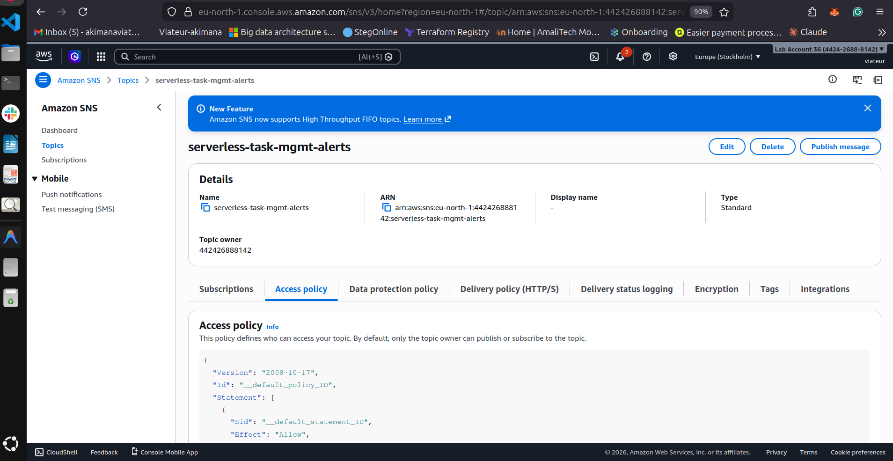 |
| Alarms           | 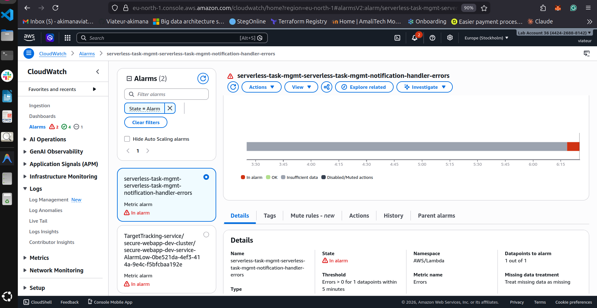 |
| SES Identities   | 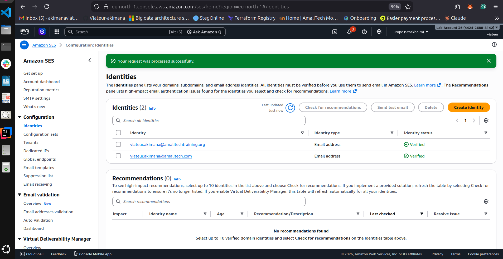 |
| CloudWatch Logs  | 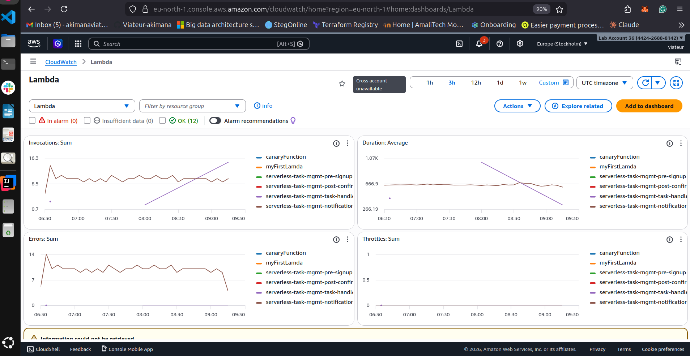 |

---

---

### Prerequisites

- [Node.js](https://nodejs.org/) (v22.22.0 or higher recommended for Vite)
- [npm](https://www.npmjs.com/) (v10+ recommended)
- [Terraform](https://developer.hashicorp.com/terraform/downloads) (v1.0+)
- [AWS CLI](https://aws.amazon.com/cli/) configured with `aws configure`

### 1. Build & Deploy Backend

The backend is written in TypeScript and must be compiled before deployment.

**Step 1.1: Build Lambda Functions**

```bash
cd backend
npm install
npm run build # Compiles TS to JS
```

**Step 1.2: Configure Terraform Variables**

Create a `terraform.tfvars` file from the example template:

```bash
cd ../terraform
cp terraform.tfvars.example terraform.tfvars
```

Edit `terraform.tfvars` and update the values:

```hcl
# AWS Configuration
aws_region   = "us-east-1"  # Change to your preferred region
project_name = "serverless-task-mgmt"

# Email Configuration
allowed_email_domains = ["amalitech.com", "amalitechtraining.org"]
sender_email          = "noreply@amalitech.com"  # Must be verified in SES
admin_email           = "admin@amalitech.com"

# Cognito Groups
admin_group_name  = "Admin"
member_group_name = "Member"
```

**Step 1.3: Deploy Infrastructure**

```bash
terraform init
terraform apply
```

**Step 1.4: Capture Outputs**

After a successful apply, note the following outputs from the terminal:
- `api_url`: Your HTTP API Gateway endpoint
- `user_pool_id`: Cognito User Pool ID
- `user_pool_client_id`: Cognito Client ID
- `aws_region`: AWS Region

### 2. Frontend Configuration
The frontend needs to know about the deployed backend services.

**Option A: Using `.env` (Recommended)**
Create a `.env` file in the `frontend/` directory:

```env
VITE_API_URL=https://<your-api-url>
VITE_USER_POOL_ID=<your-user-pool-id>
VITE_USER_POOL_CLIENT_ID=<your-client-id>
VITE_AWS_REGION=<your-region>
VITE_ADMIN_GROUP_NAME=Admin
```

**Option B: Manual Update of `aws-exports.ts`**
Open `frontend/src/aws-exports.ts` and replace the placeholders:

```typescript
export const awsConfig = {
    Auth: {
        Cognito: {
            userPoolId: 'YOUR_USER_POOL_ID',
            userPoolClientId: 'YOUR_CLIENT_ID',
        }
    },
    API: {
        REST: {
            TaskAPI: {
                endpoint: 'YOUR_API_URL',
                region: 'us-east-1'
            }
        }
    }
};
```

### 3. Running the Frontend
```bash
cd frontend
npm install
npm run dev
```

The application will be available at `http://localhost:5173`.

---

##  User Setup & Testing

### Creating an Admin User

Since admin role assignment is protected, you need to create your first admin user manually.

**Option 1: Using the CLI Script**

```bash
cd scripts
chmod +x create-admin.sh
./create-admin.sh
```

Follow the prompts to enter your email and temporary password.

**Option 2: AWS Console**

1. Go to **AWS Cognito** > **User Pools**
2. Select your user pool
3. Create a new user
4. Add the user to the `Admin` group

### Testing Application Features

Once logged in as an admin, verify the following features:

1. **Dashboard Access**: You should see the "New Task" button (Admin only)
2. **Task Creation**: Create a task with title, description, priority, and assignee
3. **Task Status Updates**: Change task status (Open → In Progress → Closed)
4. **Task Search**: Use the search bar to filter tasks by title or description
5. **Task Deletion**: Delete a task (Admin only)
6. **User List**: View all registered users (Admin only)

---

##  Security & RBAC
- **Domain Restriction**: Only `@amalitech.com` and `@amalitechtraining.org` emails can sign up (enforced via Cognito Pre-SignUp Lambda).
- **Authentication**: Mandatory email verification before the first login.
- **Authorization**: Role-Based Access Control (RBAC) enforced at both the API Gateway (Cognito Authorizer) and inside Lambda functions.
- **Admin**: Full access (Create, Assign, Update, Close).
- **Member**: Limited access (View assigned tasks, Update task status).

## DevOps & Monitoring

### Automation Scripts

The `scripts/` directory contains utilities to simplify common administrator workflows:

- **Create First Admin**: You can't sign up as an admin via the UI (for security). Use the CLI script to bootstrap your first administrator.

  ```bash
  bash scripts/create-admin.sh admin@amalitech.com YourSecurePassword123! "Master Admin"
  ```

- **SES Sandbox Setup**: A utility to quickly verify sender identities during development.

### Production Monitoring

The system includes comprehensive monitoring:

- **Lambda Alarms**: Terraform automatically creates **CloudWatch Alarms** for every Lambda function. Any 5XX error or function crash will trigger an alert.
- **SNS Alerts**: Integrated an **SNS Topic** (`task-mgmt-alerts`) where you can subscribe your email to get real-time fail notifications.
- **Least Privilege IAM**: Every role is scoped specifically to its required DynamoDB Index and SES operations.

---

## API Overview

All endpoints are protected by Cognito JWT. Include the `Authorization: Bearer <idToken>` header in requests.

- `GET /tasks`
  - Admin: returns all tasks
  - Member: returns tasks assigned to the authenticated user
  - Optional query: `?q=<search>` to filter by title/description

- `POST /tasks` (Admin only)
  - Body:
    ```json
    {
      "title": "String (required)",
      "description": "String",
      "priority": "LOW|MEDIUM|HIGH",
      "assignedTo": "email | [emails] | 'UNASSIGNED'",
      "dueDate": "ISO8601 string"
    }
    ```

- `PUT /tasks/{id}`
  - Admin: may update `status`, `priority`, `assignedTo`, `dueDate`, `description`, `title`
  - Member: may update `status` of own tasks only

- `DELETE /tasks/{id}` (Admin only)

- `GET /users` (Admin only)

Notes
- Status transitions supported: `OPEN`, `IN_PROGRESS`, `CLOSED`.
- On status changes, the system sends email notifications to assignees and the admin.

---

## AWS Amplify Deployment

To deploy the frontend (React app) to AWS Amplify:

1. Install Amplify CLI:
    ```bash
    npm install -g @aws-amplify/cli
    amplify configure
    ```
2. Initialize Amplify in your frontend directory:
    ```bash
    cd frontend
    amplify init
    ```
    - Choose Amplify Gen 1 if prompted
    - Select AWS profile and defaults
3. Add hosting:
    ```bash
    amplify add hosting
    ```
    - Choose Amazon CloudFront and S3
    - Select DEV environment
    - Choose Manual or Continuous
4. Publish to Amplify:
    ```bash
    amplify publish
    ```
5. After publishing, Amplify will provide a public URL for your deployed site.

For more details, see [Amplify Docs](https://docs.amplify.aws/cli/project/hosting/).

Follow these instructions to set up the project locally and deploy to AWS.

---

## Troubleshooting

- 401/403 errors when calling API
  - Ensure you are sending a valid Cognito ID token in the `Authorization` header.
  - Confirm your user is in the correct Cognito group (`Admin` vs `Member`).

- Cannot sign up with personal email
  - Sign-up is restricted to `@amalitech.com` and `@amalitechtraining.org` domains by design.

- SES email sending fails in dev
  - If your AWS SES account is in Sandbox, verify sender and recipient emails, or request production access.

- Terraform apply fails (permissions)
  - Verify your AWS CLI credentials and region: `aws sts get-caller-identity` and `aws configure list`.

- CORS errors in the browser
  - Make sure `VITE_API_URL` matches the deployed API Gateway URL and that you’re using HTTPS.

- Stale frontend after Amplify deploy
  - Invalidate CloudFront cache from the Amplify console or hard-refresh the browser (Ctrl/Cmd+Shift+R).

---

##  Project Structure

```text
├── backend/            # TypeScript Lambda functions
├── frontend/           # React + Tailwind CSS (v4)
├── terraform/          # IaC (Infrastructure as Code)
│   └── modules/        # Modular AWS resources (Cognito, DDB, etc.)
└── scripts/            # Automation & Admin tools
```

---

## Contributing

Contributions are welcome! Please:
- Open an issue to discuss significant changes before starting work
- Follow the existing code style and conventions
- Keep commits scoped and messages clear

---
